# Pharmacy Harness for LINE

薬局向けの LINE 患者接点 (処方せん事前送信・電子処方箋・服薬フォロー・緊急避妊薬受付) を Cloudflare 上で運用する OSS。
OSS の LINE CRM [LINE Harness](https://github.com/Shudesu/line-harness-oss) をフォークし、薬局業務に必要な画面・データ境界・監査を追加したものです。

[](LICENSE)
[](tsconfig.base.json)
[](apps/worker/wrangler.toml)
[](package.json)
[](package.json)
[](https://github.com/yusuketakuma/pharmacy-harness-line/actions/workflows/worker-ci.yml)
[](https://github.com/yusuketakuma/pharmacy-harness-line/actions/workflows/web-ci.yml)
[](https://github.com/yusuketakuma/pharmacy-harness-line/actions/workflows/repository-verify.yml)

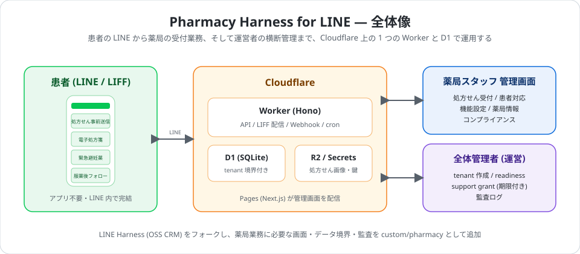

---

## なぜ Pharmacy Harness か

- **患者はアプリ不要**。普段使いの LINE から処方せんを事前に送り、受付状況を確認し、服薬後の様子を答えられる。
- **薬局は 1 つの管理画面で完結**。処方せん受付キュー、電子処方箋の受領確認、患者アンケート、継続フォローを「本日の業務」として並べる。
- **運営者は複数薬局を横断管理**。tenant ごとの稼働状況・readiness・webhook 失敗を確認し、患者情報の参照は期限付き support grant でだけ行う。
- **PHI を守る前提で設計**。tenant 分離、LIFF ID token 検証、PHI-free 通知、allowlist 方式の構造化ログ、監査イベント、開示・消去請求をコードと DB 制約で実装。
- **サーバーは Cloudflare Worker + D1 のみ**。汎用 CRM 機能 (配信・タグ・リッチメニュー・自動化) は LINE Harness から継承。

## 誰のためのものか

| 利用者 | 入口 | できること |
|---|---|---|
| **患者** | LINE のリッチメニュー / LIFF | 処方せんの撮影・事前送信、受付状況の確認、電子処方箋の手続き開始、患者情報・アンケートの登録、継続フォローと服薬後フォローへの回答、緊急避妊薬の仮受付、薬局情報 (営業時間・アクセス) の確認 |
| **薬局スタッフ** | 管理画面 (Next.js) | 受付キューの確認と状態更新、処方せん画像の閲覧 (監査付き)、電子処方箋の正式確認、患者アンケート・継続フォローの管理、機能の ON/OFF、患者向け薬局情報の編集、個人情報方針と開示・消去請求の処理 |
| **全体管理者 (運営)** | `/platform-admin` | tenant の作成と初期設定、LINE 接続・LIFF Endpoint・readiness の診断、webhook 失敗の再試行、外向き送信の一時停止、理由と期限を持つ support grant、監査ログの閲覧 |

---

## 画面イメージ

実際の画面です (ローカル環境・ダミーデータ。薬局名・患者名はすべて架空です)。

| 患者: メニュー | 患者: 処方せん事前送信 | 患者: 受付状況 |
|:-:|:-:|:-:|
| 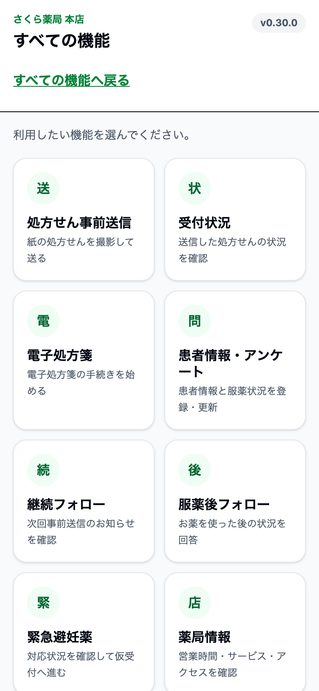 | 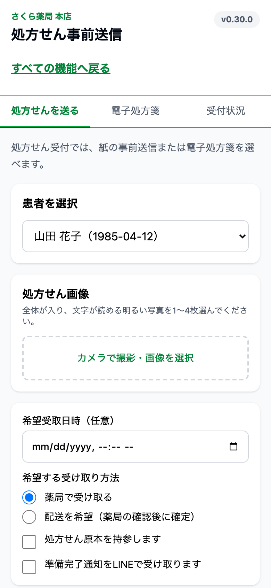 | 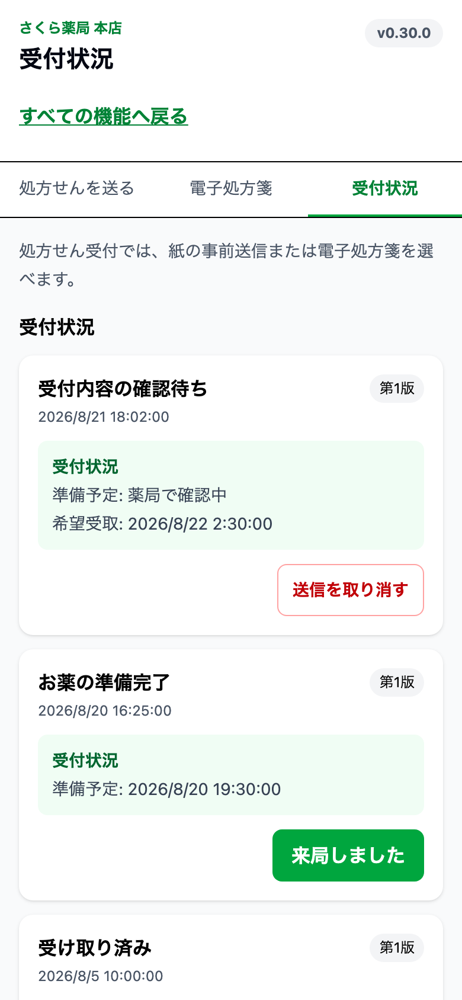 |

| 薬局スタッフ: 処方せん受付キュー | 薬局スタッフ: 患者アンケート |
|:-:|:-:|
| 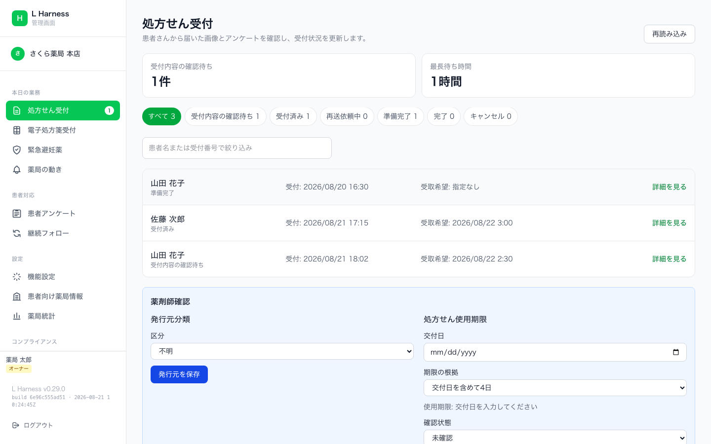 | 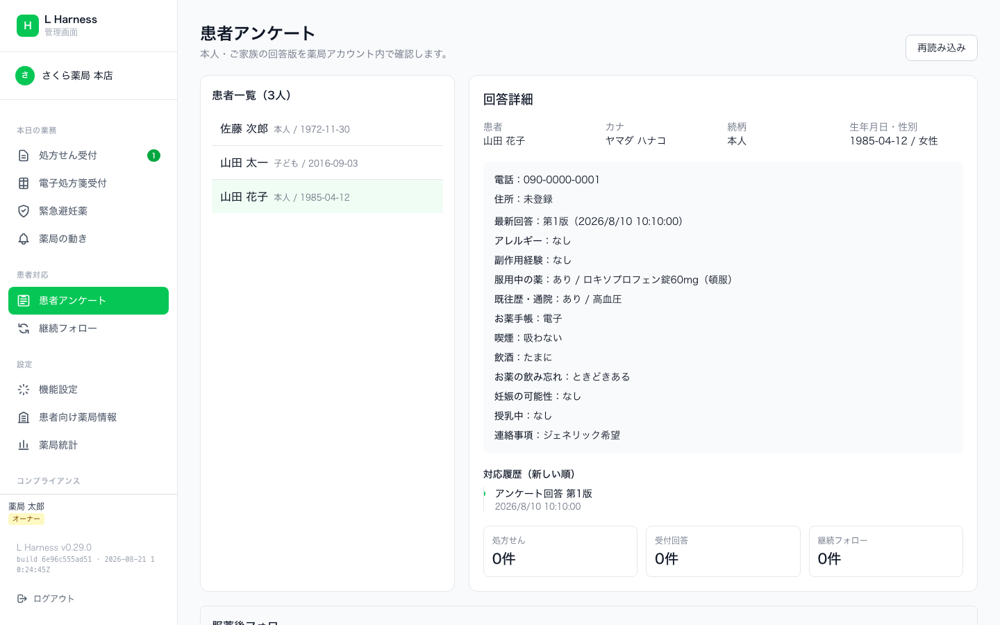 |

---

## クイックスタート

前提: Cloudflare アカウント、LINE 公式アカウント (Messaging API + LINE Login/LIFF)、Node.js 22 以上、pnpm 9。

```bash
pnpm install
wrangler login

# D1 スキーマ適用 (wrangler.toml の database 名に合わせて調整)
pnpm db:migrate:local      # ローカル
pnpm db:migrate            # リモート

# Worker / 管理画面のビルド・デプロイ
pnpm build
pnpm deploy:worker
pnpm deploy:web

# 全体管理者の初回作成 (未初期化環境でのみ有効)
pnpm platform:admin-bootstrap

# 薬局 (tenant) の作成、管理者作成、設定確認
pnpm tenant:setup
pnpm tenant:admin-bootstrap
pnpm tenant:settings -- --preflight --account-id <line_account_id>

# リッチメニュー素材の一覧 (ドラフト作成のみ。LINE への登録は別操作)
pnpm rich-menu:catalog
```

各コマンドの引数と前提は `scripts/custom/pharmacy/` 内の各スクリプト、運用手順は [docs/custom/pharmacy](docs/custom/pharmacy) と [docs/manual](docs/manual) を参照してください。

> 本番デプロイ、D1 schema 適用、tenant の有効化、LINE への変更 (リッチメニュー公開・初期表示変更・友だち一括適用) は、すべて人間の明示操作です。CLI や管理画面はドラフトと検証までを行い、外部への反映を暗黙に実行しません。

---

## 主要機能

### 患者向け LIFF

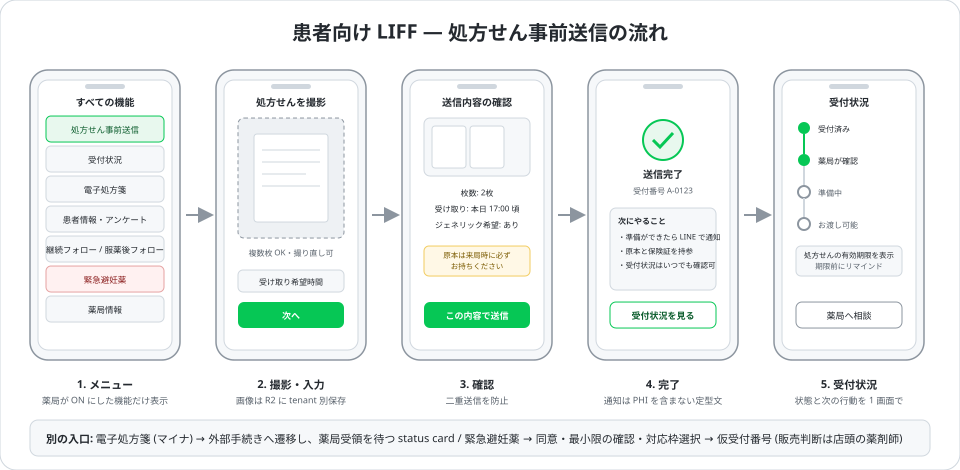

- **処方せん事前送信** — 紙の処方せんを撮影して送信。受付番号と「次にやること」を表示し、受付状況をいつでも確認できる。
- **電子処方箋** — 同じ処方せん画面のタブから handoff を作成し、外部手続きへ遷移。患者の申告と薬局の受領は別の事実として表示し、薬局スタッフの確認前に受付完了にならない。
- **患者情報・アンケート / 継続フォロー / 服薬後フォロー** — 問診の登録・更新、次回事前送信の案内、服薬後の状況回答。
- **緊急避妊薬** — 同意 → 最小限の確認 → 対応枠選択 → 仮受付番号。販売可否の最終判断は店頭の薬剤師が行い、自動判定はしない。画面と通知は中立的な表現に統一。
- **薬局情報** — 営業時間、処方せん受付時間、アクセス、支払方法などを表示。
- 薬局が OFF にした機能はメニューに出ず、直接アクセスは利用不可の案内を返す (server 側は 409 で拒否)。画面右上に動作中の LIFF バージョンを表示。

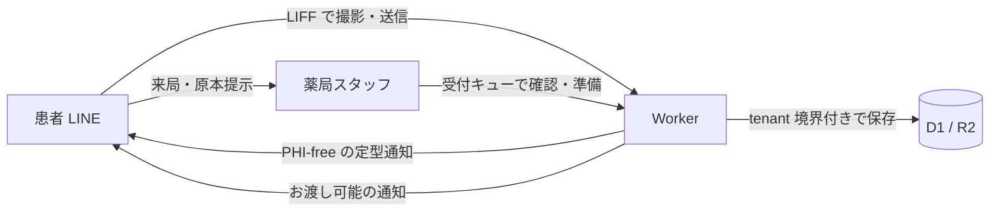

### 薬局スタッフ管理画面

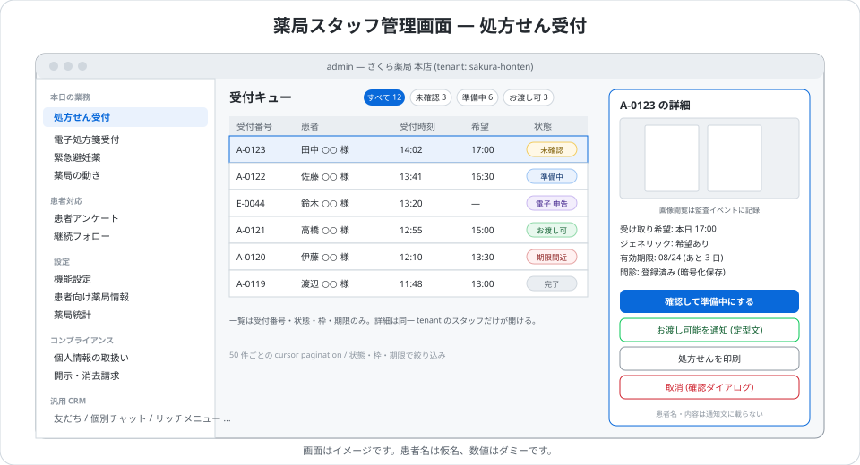

- **本日の業務** — 処方せん受付、電子処方箋受付、緊急避妊薬、薬局の動き (活動通知)。
- **患者対応** — 患者アンケート、継続フォロー。
- **設定** — 機能設定 (処方せん / 電子処方箋 / 患者アンケート / 継続フォロー / 服薬フォロー / 緊急避妊薬 / 個別チャット / 薬局情報を account 単位で ON/OFF。OFF は新規受付だけ止め、既存案件は完了・取消まで続けられる)、患者向け薬局情報、薬局統計。
- **コンプライアンス** — 個人情報の取扱い (tenant ごとの利用目的・窓口・ポリシーバージョン)、開示・消去請求。
- 不可逆操作 (受け渡し、取消、緊急停止、電子処方箋の正式確認) には確認ダイアログと二重送信防止。設定変更は revision による CAS で同時編集を検出。

### 全体管理者画面

- 薬局スタッフとは分離した `platform-admin` 認証と専用セッション。初回作成後は bootstrap 経路が閉じる。
- tenant 一覧と詳細: 職員、LINE 接続診断、期待 LIFF Endpoint、電子処方箋・緊急避妊薬の readiness (`READY` / `UNVERIFIED` / `BLOCKED`)。
- webhook 失敗の確認と監査付き手動再試行、tenant 単位の外向き送信一時停止。
- 患者情報の参照は、理由・対象 tenant・有効期限を持つ **support grant** がある場合だけ。grant はセッションに結び付き、開始・終了・参照はすべて監査ログへ。
- `pnpm tenant:settings` から同じ API を CLI で操作 (dry-run 既定、変更は明示確認と監査記録)。

### 安全性・個人情報保護

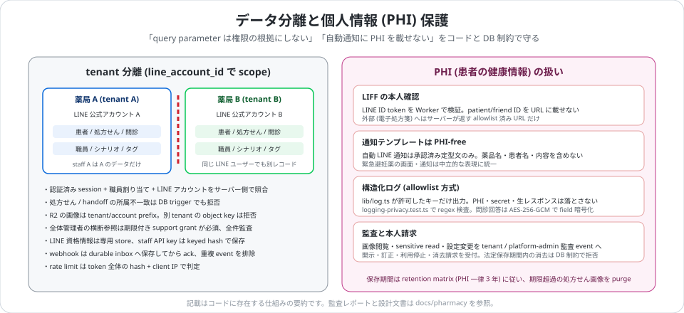

- **tenant 分離** — すべての query と mutation を `line_account_id` と認証済み職員割り当てで scope。query parameter や画面の選択値を権限根拠にしない。処方せん・handoff の所属不一致は DB trigger でも拒否。
- **LIFF の本人確認** — LINE ID token を Worker で検証。patient ID・friend ID・LIFF ID を外部 URL に付与しない。
- **PHI-free 通知** — 自動 LINE 通知は承認済み定型文のみ。通知ログに患者氏名・LINE ID・処方内容を出さない contract test。
- **構造化ログ** — `apps/worker/src/lib/log.ts` は allowlist されたキーだけを出力し、PHI・secret・request body は落ちない。
- **暗号化と資格情報** — 問診回答は AES-256-GCM の field 暗号化 (`PHARMACY_PHI_KEY_V1`)。LINE 資格情報は専用 store、職員 API key は keyed hash。
- **監査** — 処方せん画像閲覧、緊急避妊薬の sensitive read、tenant 管理操作、platform-admin 操作を監査イベントとして記録。
- **開示・消去請求と保存期間** — データ主体請求ワークフローを備え、法定保存期間 (PHI 一律 3 年) 内の消去は DB 制約で拒否。期限超過の処方せん画像は purge ジョブで削除。
- **その他** — webhook 署名検証と durable inbox、rate limit (token 全体の hash + client IP)、CORS allowlist、CSRF 対策。

### 汎用 CRM 機能を継承

LINE Harness の機能はそのまま残っています: 友だち管理、タグ、個別チャット、シナリオ配信・一斉配信・テンプレート、リッチメニュー、リマインダ、IF-THEN 自動化、自動返信、Webhook、予約、スタッフ管理 (Owner / Admin / Staff)。
薬局モードでは broadcast・marketing 系の通知を route・service・cron で fail-closed にしています。

### SDK / MCP

- `@line-harness/sdk` — TypeScript SDK。
- `@line-harness/mcp-server` — Claude Code から操作する MCP server。`packages/mcp-server/src/custom/pharmacy/` に薬局向けリッチメニュー操作を追加。
- CLI (`packages/create-line-harness`) はフォーク元の汎用セットアップ用。薬局 tenant の作成は上記 `pnpm tenant:*` を使います。

---

## アーキテクチャ

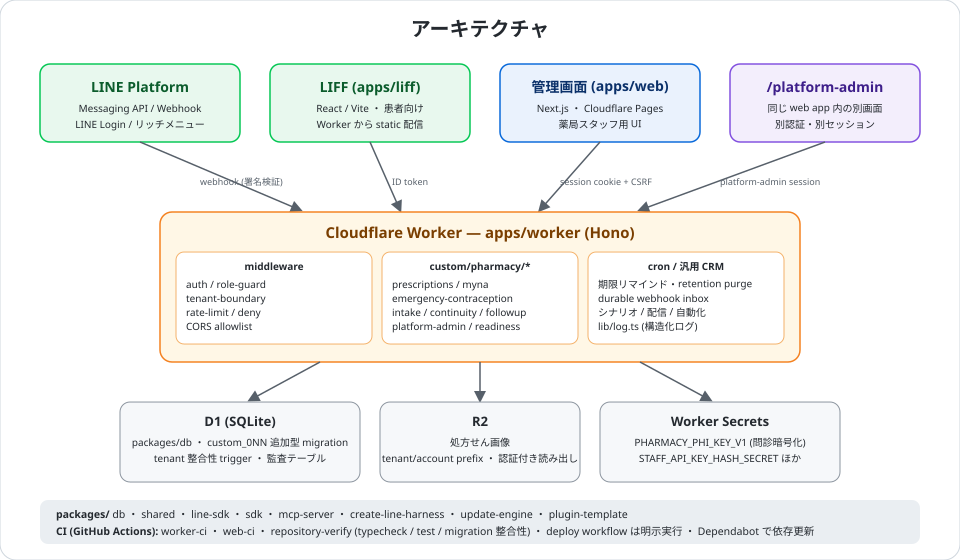

| パス | 役割 |
|---|---|
| `apps/worker` | Hono 製 Cloudflare Worker。API、LIFF 静的配信、LINE webhook、cron。薬局機能は `src/custom/pharmacy/*` |
| `apps/web` | Next.js 管理画面 (Cloudflare Pages)。`/platform-admin` は同じアプリ内の別認証画面 |
| `apps/liff` | React + Vite の患者向け LIFF。薬局画面は `src/custom/pharmacy/*` |
| `packages/db` | D1 スキーマ、`custom_0NN_*.sql` 追加型 migration、bootstrap |
| `packages/shared` / `packages/line-sdk` | 型定義、LINE API 薄ラッパー |
| `packages/sdk` / `packages/mcp-server` | TypeScript SDK、MCP server |
| `packages/create-line-harness` / `packages/update-engine` / `packages/plugin-template` | フォーク元由来のセットアップ CLI・更新エンジン・プラグイン雛形 |
| `scripts/custom/pharmacy` | tenant 作成、管理者 bootstrap、設定 CLI、リッチメニュー catalog |

---

## 運用・セキュリティ

- 設計と証跡: [MULTITENANT_OWNERSHIP_MATRIX](docs/custom/pharmacy/MULTITENANT_OWNERSHIP_MATRIX.md)、[FIELD_LEVEL_ENCRYPTION_DESIGN](docs/custom/pharmacy/FIELD_LEVEL_ENCRYPTION_DESIGN.md)、[RETENTION_MATRIX](docs/custom/pharmacy/RETENTION_MATRIX.md)、[SECURITY_REVIEW_EVIDENCE_2026-08-19](docs/custom/pharmacy/SECURITY_REVIEW_EVIDENCE_2026-08-19.md)。
- 脆弱性の報告は [SECURITY.md](SECURITY.md) に従い非公開で行ってください。
- 検証: `pnpm verify:ci` (typecheck / test / migration 整合性)。

### バージョンについて

OSS パッケージの version (`package.json`) と、薬局サービスのリリースタグ `pharmacy-v*` (CHANGELOG の「Pharmacy vX.Y.Z」) は別の identity です。片方からもう片方を推測しないでください。また、ローカルのコード・テスト通過・リリースメタデータ・デプロイ証跡・本番稼働はそれぞれ別の事実として扱います。

---

## 今後の予定とロードマップ

- [CHANGELOG](CHANGELOG.md) — リリースごとの変更履歴 (Pharmacy v0.23 以降)
- [GROWTH_LOOP_ROADMAP](docs/custom/pharmacy/GROWTH_LOOP_ROADMAP.md) — 薬局統計 (Growth Loop) の段階的な拡張計画
- [GROWTH_LOOP_KPI_CONTRACT](docs/custom/pharmacy/GROWTH_LOOP_KPI_CONTRACT.md) — 計測する KPI とその定義
- [PLANS.md](PLANS.md) — 進行中タスクの一覧

---

## ドキュメント

- [CHANGELOG](CHANGELOG.md) — Pharmacy v0.23 以降の変更履歴
- [docs/custom/pharmacy](docs/custom/pharmacy) — 薬局固有の設計・運用文書
  - [customer-production-update-checklist](docs/custom/pharmacy/customer-production-update-checklist.md)
  - [PHARMACY_PRINT_AND_ACTIVITY_NOTIFICATIONS](docs/custom/pharmacy/PHARMACY_PRINT_AND_ACTIVITY_NOTIFICATIONS.md)
  - [rich-menu-update-review](docs/custom/pharmacy/rich-menu-update-review.md)
  - [患者向け 1 枚マニュアル](docs/custom/pharmacy/manual-patient.md) / [薬局スタッフ向け 1 枚マニュアル](docs/custom/pharmacy/manual-staff.md)
- [docs/PHARMACY_IMPLEMENTATION_PLAN.md](docs/PHARMACY_IMPLEMENTATION_PLAN.md) — 不変条件と中央デプロイ契約
- [docs/ADMIN-AUTH.md](docs/ADMIN-AUTH.md) — 管理画面認証
- [docs/manual](docs/manual) — フォーク元の運用マニュアル (汎用 CRM 機能)
- [docs/wiki](docs/wiki) — フォーク元の機能別 Wiki (配信・タグ・MCP など)
- [AGENTS.md](AGENTS.md) — このリポジトリで作業する際の境界 (custom/pharmacy seam、PHI-free、human gate)

---

## ライセンス

[MIT License](LICENSE)。フォーク元 LINE Harness と同じく、商用利用・改変・再配布は自由です。

---

## コントリビュート

Issue / PR は [yusuketakuma/pharmacy-harness-line](https://github.com/yusuketakuma/pharmacy-harness-line) へ。
汎用 CRM 部分の改善はフォーク元 [Shudesu/line-harness-oss](https://github.com/Shudesu/line-harness-oss) に投げる方が全体の利益になります。運用上のルールは [CONTRIBUTING.md](CONTRIBUTING.md) を参照してください。

---

## 開発者 / クレジット

- **フォーク元**: [LINE Harness](https://github.com/Shudesu/line-harness-oss) — 野田修一 ([@Shudesu](https://github.com/Shudesu))
- **薬局向けフォーク**: [github.com/yusuketakuma/pharmacy-harness-line](https://github.com/yusuketakuma/pharmacy-harness-line)

---

> **Pharmacy Harness for LINE** — LINE Harness を土台に、薬局の患者接点を安全に運用するための OSS
